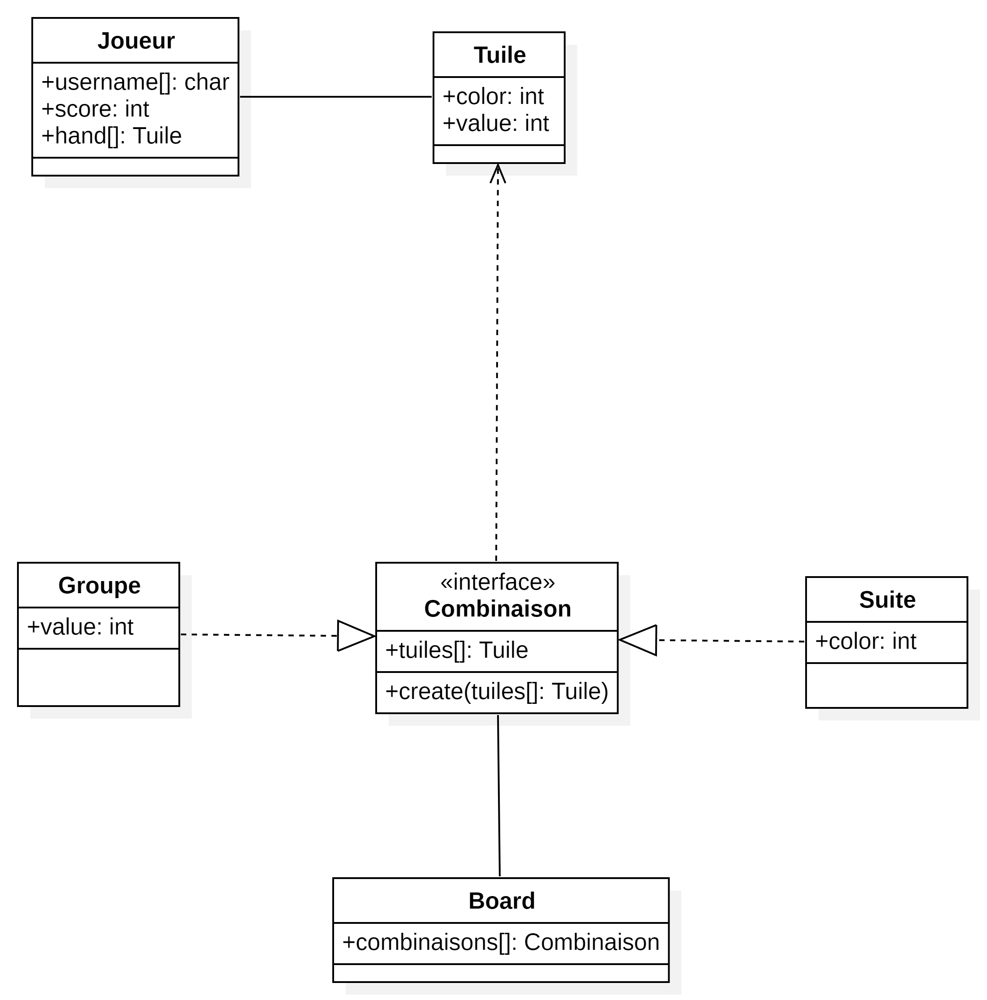

  

# Rapport d’analyse et de conception  
## Projet Algorithmique 2025/2026 – Développement du jeu Rummikub en C  
### Groupe ...  – IATIC3

**Membres de l’équipe :**  
- BENBACHA Kamar
- CHOISY Alexis
- DA SILVA FERREIRA Lucas
- DEGAT Teddy
- FOURNIE Baptiste

**Encadrant :** ABOUDA Dhekra
**Date de remise :** 30 novembre 2025  

---

## Sommaire

- [Rapport d’analyse et de conception](#rapport-danalyse-et-de-conception)
  - [Projet Algorithmique 2025/2026 – Développement du jeu Rummikub en C](#projet-algorithmique-20252026--développement-du-jeu-rummikub-en-c)
    - [Groupe ...  – IATIC3](#groupe----iatic3)
  - [Sommaire](#sommaire)
  - [I. Analyse des besoins de l’utilisateur](#i-analyse-des-besoins-de-lutilisateur)
    - [1. Contexte du projet](#1-contexte-du-projet)
    - [2. Objectifs fonctionnels](#2-objectifs-fonctionnels)
    - [3. Public visé](#3-public-visé)
    - [4. Contraintes](#4-contraintes)
  - [II. Définition du système à réaliser](#ii-définition-du-système-à-réaliser)
    - [1. Fonctionnement général](#1-fonctionnement-général)
  - [III. Cahier des charges](#iii-cahier-des-charges)
    - [1. Description globale des fonctions](#1-description-globale-des-fonctions)
    - [2. Fonctions bonus](#2-fonctions-bonus)
  - [IV. Structures de données prévues](#iv-structures-de-données-prévues)
  - [V. Liste des fonctions principales](#v-liste-des-fonctions-principales)
  - [VI. Répartition des tâches](#vi-répartition-des-tâches)
  - [VII. Conclusion](#vii-conclusion)

---

## I. Analyse des besoins de l’utilisateur

### 1. Contexte du projet
Le projet s’inscrit dans un projet de première année d'école d'ingénieur (IATIC3).  
Il consiste à développer en langage C une version fonctionnelle et jouable du jeu Rummikub, avec une interface graphique interactive et la possibilité de jouer à plusieurs, y compris contre l’ordinateur.

### 2. Objectifs fonctionnels
Le programme doit permettre :
- de jouer à partir d’une interface graphique
- d’entrer et de sauvegarder les pseudos des joueurs 
- de jouer à plusieurs joueurs humains (2 à 4)  
- de jouer contre un ou plusieurs ordinateurs
- de mémoriser les scores dans un fichier

Des fonctionnalités bonus peuvent être ajoutées :
- chronomètre limitant la durée d’un tour à une minute ;  
- IA stratégique (plutôt que purement aléatoire) ;  
- animations ou effets visuels.

### 3. Public visé
L’application vise deux publics :
1. Les joueurs, qui utilisent le programme comme jeu complet.  
2. L’encadrant, qui évalue la conception algorithmique, la clarté du code et la compréhension globale.

### 4. Contraintes
- Langage imposé : C uniquement
- Interface graphique obligatoire (bibliothèque libre : GTK, SDL2, raylib, etc.)
- Groupe de 5 étudiants
- Date limite du rapport d’analyse : 30 novembre 2025
- Soutenance prévue le 30 janvier 2026

---

## II. Définition du système à réaliser

### 1. Fonctionnement général
Le système est un programme interactif simulant le jeu Rummikub.  
Il comprend trois parties principales :
1. Le moteur de jeu : logique, règles, tours, vérifications
2. L’interface graphique : affichage du plateau, tuiles, menus  
3. Les modules de persistance : sauvegarde des scores, pseudos, etc.

Lorsqu’on lance le programme, le menu principal permet :
- de démarrer une partie (2 à 4 joueurs, humains ou IA) 
- d’afficher les scores précédents
- ou de quitter

Le jeu se déroule en tours successifs :
- tirage aléatoire de 14 tuiles par joueur
- détermination de l’ordre de jeu
- gestion des actions : poser, piocher, réorganiser, vérifier
- calcul des scores à la fin de la partie

La partie se termine quand un joueur n’a plus de tuiles ou que la pioche est vide.

---

## III. Cahier des charges

### 1. Description globale des fonctions

| Fonctionnalité | Description |
|----------------|-------------|
| Lancement du jeu | Affichage d’un menu principal : *Jouer*, *Scores*, *Quitter* |
| Saisie des joueurs | Enregistrement des pseudos dans un fichier |
| Création du plateau | Génération des 106 tuiles (104 + 2 jokers) |
| Distribution des tuiles | Donne 14 tuiles par joueur |
| Tour de jeu | Alternance entre joueurs, avec vérification automatique des règles |
| Vérification des combinaisons | Validation des séries et séquences posées sur la table |
| Gestion du joker | Règles spécifiques de remplacement et d’utilisation immédiate |
| Calcul des points | Détermination des scores positifs et négatifs |
| Fin de partie | Détection du gagnant et mise à jour du fichier de scores |
| Jeu contre IA | L’ordinateur joue automatiquement (aléatoire ou stratégie simple) |

### 2. Fonctions bonus
- Limite de 60 secondes par tour
- Animation graphique des tuiles
- Sauvegarde et reprise de partie

---

## IV. Structures de données prévues

Les structures principales modélisent les tuiles, les joueurs et la partie
Elles doivent être simples, dynamiques et réutilisables dans les modules du projet

Description fonctionnelle des modèles de données :

* La structure **Tuile** représente une tuile, on lui associe une valeur allant de 1 à 13 (13 représentant un joker) et une couleur allant de 1 à 4 (respectivement BLEU, VERT, ROUGE, ORANGE)

* La structure **Combinaison** représente une combinaison de `Tuile`.

* La structure **Groupe** représente une `Combinaison` de tuile toute de même valeur

* La structure **Suite** représente une `Combinaison` de tuile toute de même couleur

* La structure **Joueur** représente un joueur, il possède un nom d'utilisateur, un score ainsi qu'une main de `Tuiles`

* La structure **Board** représente le plateau du jeu, il contient une liste de `Combinaison`

---

## V. Liste des fonctions principales

[A FAIRE]

---

## VI. Répartition des tâches

[A FAIRE]

---

## VII. Conclusion

Ce rapport constitue la base de conception du projet Rummikub.  
Il décrit les besoins fonctionnels et techniques, la structure du système et l’organisation de l’équipe.  
Le développement suivra une approche incrémentale, avec un premier prototype prévu avant les vacances de Noël.  

La version finale devra proposer un jeu stable, fidèle aux règles du Rummikub, intégrant une interface graphique fluide et une intelligence artificielle fonctionnelle.  
Le code sera documenté et testé pour garantir sa clarté, sa robustesse et sa conformité aux consignes de l’encadrant.
